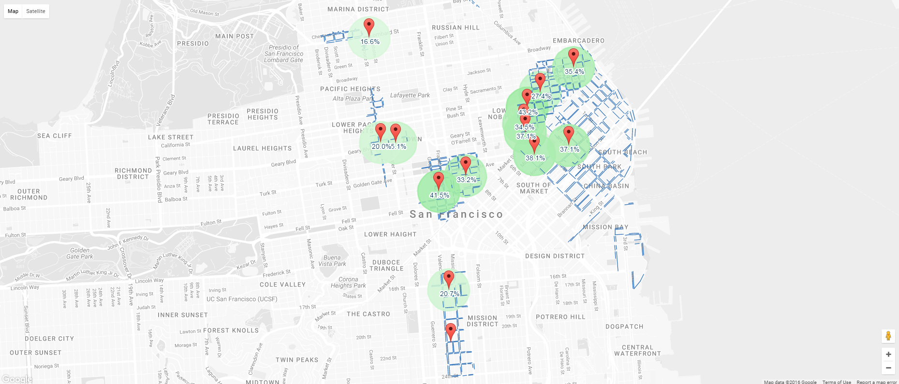

# sfpark-geojson

Simple javascript module for translating the response taken from an SFPark API (http://api.sfpark.org/sfpark) query to a GeoJSON compatible format. This can then be used with a GeoJSON compatible
service or application such as Google Maps.

## Usage
```html
<script type="text/javascript" src="sfpark-geojson.js"></script>
```

```javascript
var queryUrl = '//crossorigin.me/http://api.sfpark.org/sfpark/rest/availabilityservice?radius=3.0&uom=mile&response=json';
$.ajax({
  type: 'GET',
  dataType: 'json',
  url: queryUrl
}).done(function(data) {
  var geoJson = sfParkGeoJson.translate(data);
  //do things with geoJson
});
```

```javascript
var map = new google.maps.Map(document.getElementById('map'), { });
map.data.addGeoJson(geoJson);
```

## Sample

A sample Google Map using sfpark-geojson can be viewed here:

  https://htmlpreview.github.io/?https://github.com/plmwong/sfpark-geojson/blob/master/public/garage-availability.html

Or here:

  https://htmlpreview.github.io/?https://github.com/plmwong/sfpark-geojson/blob/master/public/parking-rates.html

If you'd rather run locally, you can run a static web server using _nodejs_ and _npm_:

```shell
npm install
node .
```

Then browse to http://localhost:8080/garage-availability.html to view a sample Google Map using data from the SFPark API.


